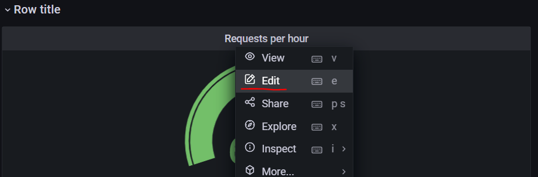
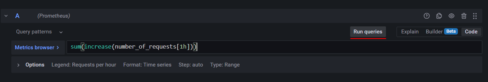

# Opperation repo for the Remla project
Here you can find the files for starting the project using helm, istio and kubernetes.

## Required setup

To start the application you will need a couple things to be running/installed. It is assumed these steps have been executed. If this is not the case you can look at their specific documentation on how to execute them.
You will need the following:
- A running [minikube](https://minikube.sigs.k8s.io/docs/start/) cluster with ingress addon enabled
- Have `minikube tunnel` running
- [Helm](https://helm.sh/docs/intro/install/) installed
- [Istio](https://istio.io/latest/docs/setup/install/) installed
    - Make sure you have enabled istio injection by running: `kubectl label ns default istio-injection=enabled`
    - Also make sure you have enabled the grafana and kiali dashboards that come with an istio installation. An example can be found [here](https://istio.io/latest/docs/setup/getting-started/#dashboard)


## Running the application

### Installing with helm
The easiest way of installing the application is using helm and the GHCR. By running the following command, helm will install the chart in your cluster with the name sentiment.
```
helm install sentiment oci://ghcr.io/remla23-team01/operation/charts/sentimentchart
```

If you have cloned the repository you can also install the chart using the following command.
```
helm install sentiment .\sentimentchart
```


### Adding rate limiter
Unfortunatly this does not yet install the rate limiter to limit traffic to the model service. To add this to the cluster run:
```
kubectl apply -f .\envoy.yml
```

### Using the application
You should now be able to visit the following urls:
- http://localhost
  - Here you can submit reviews to be classified and you will be asked if the prediction was correct
- http://localhost/admin
  - A dashboard for an admin to view all reviews and make changes to user feedback
- http://localhost/metrics
  - The url that prometheus scrapes for the metrics


### Running Istio Dashboads
To have a look at the metrics collected by prometheus and the graphs in the grafana dashboard we first have to create the url.
```
istioctl dashboard grafana
```
Now by going to http://localhost:3000 you should be able to see the "Restaurant Sentiment" dashboard. If it is not there you can import the graph from the grafana folder.

Sometimes the graphs seem to not show any information. To fix this you have to press edit.


And click on the Run queries button. Now the metrics should show up.


To start the kiali dashboard and view how the different parts are connected run:
```
istioctl dashboard kiali
```
you can now visit http://localhost:20001/kiali


